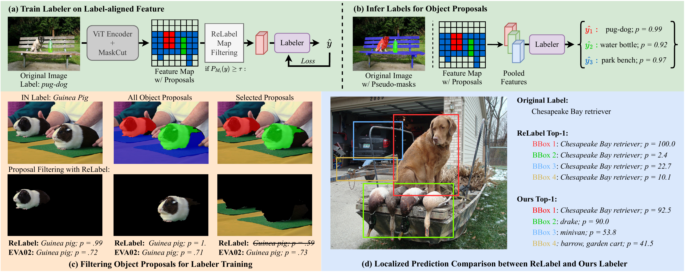
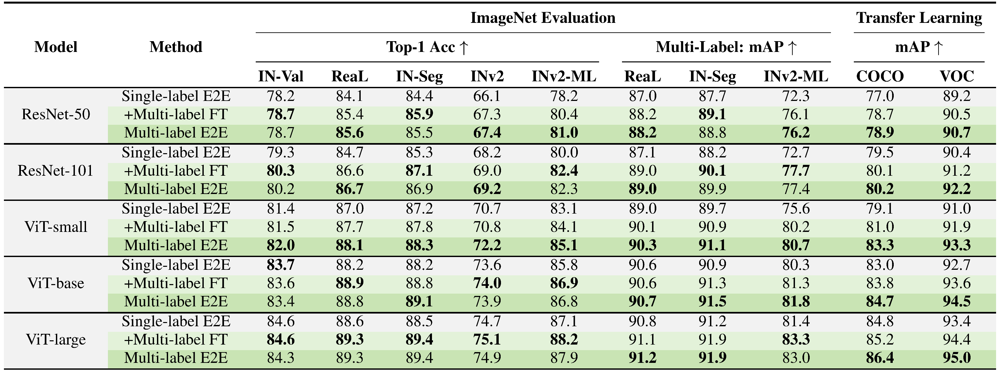
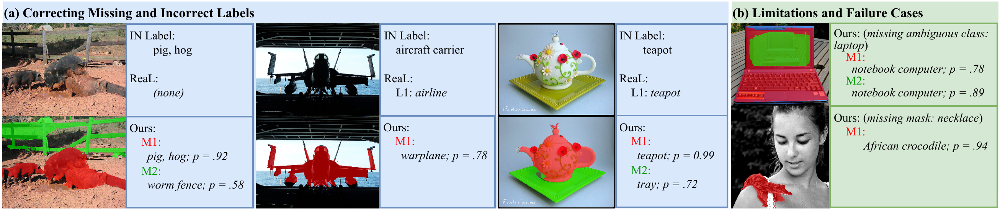

# Unlocking ImageNet’s Multi-Object Nature: Automated Large-Scale Multilabel Annotation

Official repository for the [paper](https://arxiv.org/abs/2603.05729): **Unlocking ImageNet’s Multi-Object Nature: Automated Large-Scale Multilabel Annotation**

## Implementation

- **`code/`** — Reference code implementation.
- **`multilabel/`** — Our multilabel ImageNet-1K annotations.

## Paper summary

ImageNet images often contain multiple objects, but the benchmark provides only one label per image. We generate spatially grounded multi-label annotations for the full ImageNet-1K training set and show consistent gains on ImageNet variants and downstream multi-label transfer.

**Key contributions.**

- Automated multi-label annotation for ~1.28M ImageNet-1K training images (no human labeling).
- Labels are **region-grounded** (each label tied to a mask/proposal), improving interpretability.
- Region-aligned training reduces context shortcuts by training on proposals that match the original label.
- Improves in-domain accuracy and transfer to COCO/VOC across architectures.


*Figure 1. Comparison of Existing ImageNet Train-split Relabeling Strategies with Ours. Original ImageNet annotations assume a single label per image. **(a)** MIIL adds hierarchical labels from ImageNet-21K but lacks object-level distinctions. **(b)** ImageNet-Segments offers pixel masks for 9k training images with single object annotation. **(c)** ReLabel assigns soft labels via a $15^2$ patch map, requiring crop coordinates to extract local supervision. **(d)** In contrast, our method generates explicit multi-label annotations with corresponding spatial masks, offering true multi-object labeling for the entire training set.* 

## Method

1. **Unsupervised object discovery (self-supervised ViTs):** generate multiple object proposal masks per image (MaskCut on ViT features).
2. **Region selection aligned to the original label:** keep proposals strongly supported by a per-location logit map.
3. **Lightweight labeler training:** freeze the ViT backbone; train a small MLP head on pooled region features.
4. **Dataset-wide labeling:** run the labeler on all proposals and aggregate unique, high-confidence predictions into image-level multi-labels (retaining masks).

  

*Figure 2. Overview of our relabeling pipeline. **(a)** We apply MaskCut on DINOv3 ViT features to generate object proposals. ReLabel maps are used to filter proposals most aligned with the original ground-truth label, which supervise a lightweight labeler. **(b)** At inference, the labeler predicts class scores for each proposal, enabling spatially grounded multi-label annotations.  **(c)** Compared to a global classifier (e.g., EVA02, ReLabel improves proposal filtering while can still produce high-confidence false positives. **(d)** Visualization of top-1 predictions per region shows our labeler better disambiguates multiple objects than ReLabel, avoiding context bias and recognizing distinct object categories.* 

## Main Results
- We compare original single-label training, fine-tuning with our multi-labels (Multi-label FT), and end-to-end multi-label training (Multi-label E2E) across various model architectures. Our multi-label supervision improves in-domain performance on ImageNet and its variants, and yields consistent gains in downstream multi-label transfer to COCO and VOC. 

  


 

*Figure 3. Qualitative examples comparing our multi-label annotations against ImageNet and ReaL. **(a)** Our method successfully corrects missing or incorrect labels from ReaL by identifying additional objects and providing improved grounding. **(b)** Representative failure cases, including ambiguity (e.g., notebook vs. laptop) and missed object proposals.* 

## Citation

If you find this work useful, please consider citing:

```bibtex
@article{chen2026multilabel_imagenet,
  title   = {Unlocking ImageNet's Multi-Object Nature: Automated Large-Scale Multilabel Annotation},
  author  = {Chen, Junyu and Harun, Md Yousuf and Kanan, Christopher},
  journal = {arXiv preprint arXiv:2603.05729},
  year    = {2026},
  url     = {https://arxiv.org/abs/2603.05729}
}
```